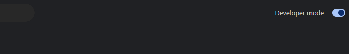
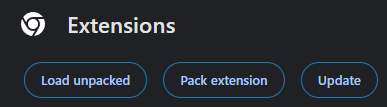
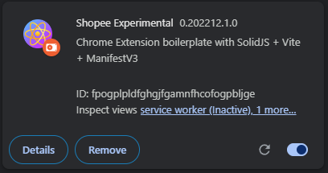
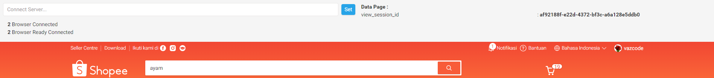
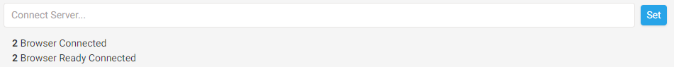
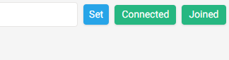

# Manual Shopee Connector Extension

## Load Extension
- Masuk ke chrome://extensions/
- Nyalakan developer mode di pojok kanan atas ( jika belum menyala )

- Load extensi dengan klik "Load Unpacked" di pojok kirim

- Pilih folder extensi yang sudah didownload dari launcher
- Extensi akan tampil seperti di bawah, nyalakan switch di pojok kanan bawah ( jika belum menyala )

- Klik detail dan nyalakan "Pin to toolbar" dan "Allow in incognito" ( jika ingin dapat berjalan di incognito )

## Turn On Worker
- Masuk ke halaman shopee dan lakukan pencarian
- Lalu akan muncul tampilan worker seperti gambar di bawah, jika tidak muncul lakukan reload page hingga tampilannya muncul

- Masukkan server connector di input dan klik set lalu refresh

- Worker telah siap jika ada tanda "Connected" dan "Joined" di sebelah set
